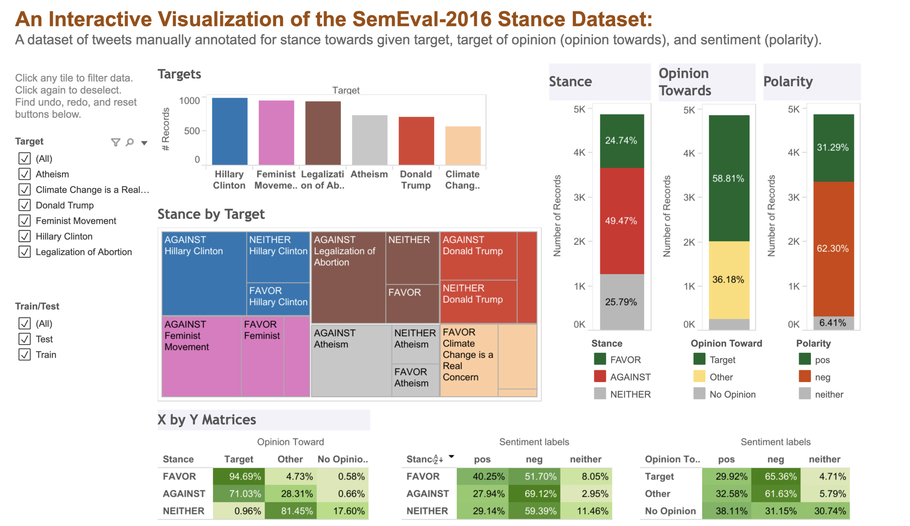

# 舆论

中文舆论，通常对应的英文术语是Public Opinion，在某些特殊的场合，也对应popular opinion，强调流行观点。

## 公众 (Public)

简单来说，公众可以被理解为共享某种共同点的人，或者共同面对特定问题的一群人。有些人属于“关注型公众”（attentive public），他们密切关注政府和政治整体事务。另一些人则是“议题公众”（issue publics）的成员，他们只聚焦于某些具体的公共政策争论，例如堕胎或国防开支，而对其他议题置之不理（Stimson, 1999）。还有一些公众成员对政治或议题几乎没有兴趣，他们的关切可能无法得到代表。

## 意见 (Opinion)

“意见”是人们在特定议题、政策、行动或领导人身上所采取的立场——支持、反对、中立或未决定。意见不是事实，而是人们对某一特定政治对象的情感表达。民调人员在进行问卷调查时，常对受访者说：“没有对错之分，重要的是您的想法。”意见与态度相关，但并不相同。态度是对人、群体或制度的持久性、总体性倾向。态度往往塑造意见。例如，那些强烈支持种族平等的人，往往会支持旨在限制住房和就业歧视的公共政策。

### 个体意见的平等

公共舆论可以被视为个体意见的集合，在这种观点下，所有意见都应得到平等对待，而不论表达意见的人是否对某个问题具备知识。因此，公共舆论就是社会各个群体中人们偏好的聚合。利用民意调查来衡量人们的想法正是这种观点的基础（Glynn 等，1999）

### 多数人的意见更重要

另一种观点认为，公共舆论是由大多数人对某一问题所持的意见构成的。在民主制度中，多数人的意见才是最应当被重视的，并且应该指导政府领导人的决策。少数人的意见相较于多数人的意见则不那么重要。这种公共舆论的看法与普选的理念相一致，因为每个公民都有权对某个问题、政策或领导人发表意见——本质上相当于投票。最终，最多人所持的立场——换句话说，获得最多“投票”的立场——就是决策者应该采纳的立场。

然而，公众很少会在某一问题上持有完全统一的意见。公众的偏好常常存在显著分歧，而且并不会出现明确的多数意见。这种情况给试图将这些偏好转化为政策的领导人带来了挑战。

### 精英意见

政治家、民调人员、政策专家、社会活动家和记者通常承担“意见领袖”的角色，他们塑造、创造并解读公共舆论。这些政治精英专注于追踪公共事务——这就是他们的工作（Zaller, 1992）。著名记者和社会评论家 Walter Lippmann 指出，普通人既没有时间，也没有兴趣去处理应对国家所面临的各种复杂问题这一“不可能完成的任务”。他们没有机会直接体验大多数政治事件，而必须依赖精英通过大众媒体传递的二手信息。在 Lippmann 看来，公共舆论最好由那些具备知识和能力的专家来管理，以推动政策。因此，最重要的应该是精英意见，而不是普通公民的看法。

## 舆论的定义

| 学者 | 年代/著作 | 定义 | 特点 |
|------|-----------|------|------|
| Walter Lippmann | 1922，Public Opinion | 公共舆论是“关于某些公共事务的那些意见的集合，这些意见在公众心目中是与他们有关的。” | 强调舆论并非直接反映现实，而是公众通过“图像与刻板印象”去理解世界，是心理建构。 |
| Herbert Blumer | 1948 | 公共舆论不是统计学意义上所有个体意见的加总，而是由有影响力的群体在互动中形成的集体判断。 | 强调“群体互动”和“社会权力”，认为舆论是社会过程，而非简单的个人意见总和。 |
| V. O. Key Jr. | 1961，Public Opinion and American Democracy | 公共舆论是“在特定议题上，对政府官员采取行动有约束力的意见分布。” | 突出舆论对政府的影响力，是民主制度中制约决策者的力量。 |
| Elisabeth Noelle-Neumann | 1974，沉默的螺旋 | 公共舆论是一种社会控制力量，它决定哪些观点可以公开表达，哪些观点会被沉默。 | 强调“社会压力”与“沉默效应”，少数意见者因害怕孤立而保持沉默。 |

简单来说：

- 舆论指的是人们所持有的想法、信念和态度的分布；
- 当我们说舆论支持某事时，这意味着它代表了**大多数人**的想法，而非所有人的想法；
- 公共舆论更准确的衡量方式是通过科学的民意调查。

## 舆论的四个要素

构成舆论的四个要素

- 方向（Direction）
- 强度（Intensity）
- 稳定性（Stability）
- 显著性（Salience）

### 方向

指公众态度的取向：**赞成/反对、正面/负面、支持哪一方等**。它回答“朝哪边”的问题。方向决定了政策支持度，是最**直观**的舆论信号。

| 方法 | 测量方式 | 说明/指标 |
|------|----------|-----------|
| 二分题（赞成/反对） | 问卷调查 | 直接获取公众态度方向 |
| 名义多选题（支持方案A/B/其他） | 问卷调查 | 细分不同立场或选项 |
| 感觉温度计（0–100） | 问卷调查 | 量化支持/反对的程度 |
| 净支持度（%赞成 − %反对） | 指标计算 | 反映总体倾向 |
| 支持/反对比值 | 指标计算 | 衡量两方力量对比 |
| 分布形态（双峰/偏态） | 指标计算 | 判断舆论是否极化或集中 |
| 立场识别（stance detection） | 社媒/NLP | 判断文本对议题的支持/反对/中立 |
| 情感极性分类（polarity classification） | 社媒/NLP | 计算正面与负面贴文占比 |

原先的立场识别，需要依赖特征工程（词袋模型，TF-IDE等）、神经网络、预训练模型（RoBERTa, Sentence-BERT），进入大模型时代后，可通过提示学习的方法快速识别：

- **Zero-shot / Few-shot**：用 GPT、Qwen 等大模型，通过提示词让模型直接分类（如“这条微博对延迟退休政策是支持还是反对？”）
- **Instruction Tuning / In-context Learning**：给模型几个示例，让它学会立场识别

其优点是不需要大量标注数据，不过输出结果的稳定性和一致性还需要进一步验证。

实验数据集：Twitter stance detection （[Semeval2016-task6](https://afshinrahimi.github.io/semeval2016-task6/)）

可视化动图：[An Interactive Visualization](https://www.saifmohammad.com/WebPages/StanceDataset.htm)

### 强度

指方向的强烈程度，它回答多么支持或者反对等。态度更强烈者更可能投票、捐款、发帖、游行，进而放大影响力。

| 方法 | 测量方式 | 说明/指标 |
|------|----------|-----------|
| Likert 量表（“强烈赞成/赞成/中立/反对/强烈反对”） | 问卷 | 捕捉态度强度分布 |
| 信念确信度（confidence） | 问卷 | 受访者对自己意见的确信程度 |
| 重要性感受（importance to you） | 问卷 | 议题对个人的重要性评价 |
| Top-2-Box 与 Bottom-2-Box 差值 | 指标 | 强支持与强反对群体差异 |
| 平均强度得分 | 指标 | 综合计算总体态度强度 |
| 行为倾向题（是否改变投票/捐款/参加集会） | 指标 | 衡量强度与政治参与的关系 |
| 情感分值幅度 |score| |
| 极端措辞比例 | 社媒/NLP | 强烈词汇（如“绝对”“完全”）占比 |
| 语气强度（感叹号、上限词等） | 社媒/NLP | 在线表达的情绪化程度 |

### 稳定性

态度随时间的持久性与易变性。它回答“是否经得起时间/事件冲击”的问题。稳定的态度可用于中长期预测与政策路径依赖分析；不稳定的态度易受事件、媒体议程与经济冲击影响。

| 方法 | 测量方式 | 说明/指标 |
|------|----------|-----------|
| 面板调查 | 调查设计 | 同一批人反复测量，追踪意见变化 |
| 滚动横截面（RCS） | 调查设计 | 不同样本的连续调查，反映总体趋势 |
| 重复横截面 + 加权 | 调查设计 | 严格抽样与权重控制，保证趋势稳定性 |
| 时间序列波动 | 指标 | 移动标准差/方差衡量舆论波动程度 |
| 半衰期计算 | 指标 | 冲击后回归均值所需时间，反映稳定性 |
| 变点检测（CUSUM/贝叶斯变点） | 指标 | 判断舆论趋势发生显著变化的时点 |
| 概念漂移（concept drift） | 社媒/NLP | 议题主题或立场随时间的漂移 |
| 周度/日度波动分析 | 社媒/NLP | 关键信号在社交媒体上的短期波动 |

### 显著性

某议题在个体或社会议程中的“重要性/当务之急”程度。它回答“在你的优先级里排第几”的问题。显著性决定注意力与资源分配，决定一票是否“绑在”该议题上（single-issue voters/issue publics）

| 方法                           | 测量方式 | 说明/指标                             |
| ------------------------------ | -------- | ------------------------------------- |
| Most Important Problem（MIP）  | 问卷     | 询问“你认为当前最重要的问题是什么”    |
| 议题优先级排序                 | 问卷     | 受访者对多个议题排序，反映关注顺序    |
| 预算分配题（分配100分）        | 问卷     | 让受访者分配权重，体现相对重视程度    |
| Top-3比例                      | 指标     | 将某议题列入前三的重要性比例          |
| 平均权重得分                   | 指标     | 各议题在预算分配题中的平均得分        |
| 个人 vs 群体差异               | 指标     | 比较个体和群体层面显著性差距          |
| 搜索指数（关键词热度）         | 计算     | 通过百度指数/Google Trends 衡量关注度 |
| 新闻报道份额（Share of Voice） | 计算     | 某议题在新闻报道中的占比              |
| 社媒话题占比与停留时长         | 计算     | 议题在社交媒体上的关注规模与深度      |

常见误区：

- 媒体曝光 ≠ 个体显著性
- 把“态度强度高”误当“显著性高”——一个人可能强烈支持但近期并不把它当头号问题。

## 四维联动

- 高方向支持 × 高强度 × 高显著性 × 高稳定性：核心民意共识，适合推进。
- 高支持但低显著性：潜在“沉默的多数”；需要提升注意力与叙事连接。
- 高显著性但方向分裂：高风险、需精细化框架与议题切割。
- 低稳定性：以监测为先，避免过度承诺。

## 参考文献

Stimson, James A. *Public Opinion in America*. 2nd ed., Westview, 1999.

Zaller, J., *The Nature and Origins of Mass Opinion* (New York: Cambridge, 1992).